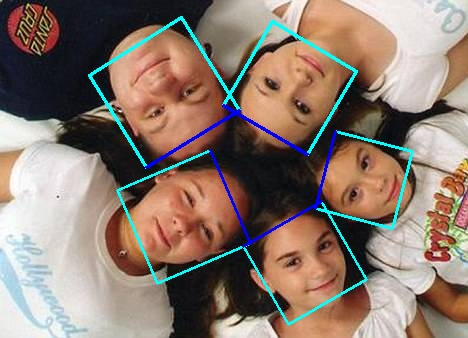
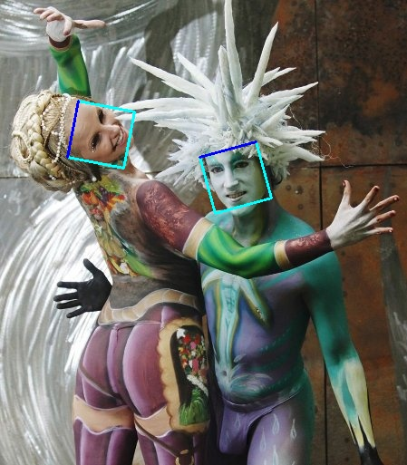
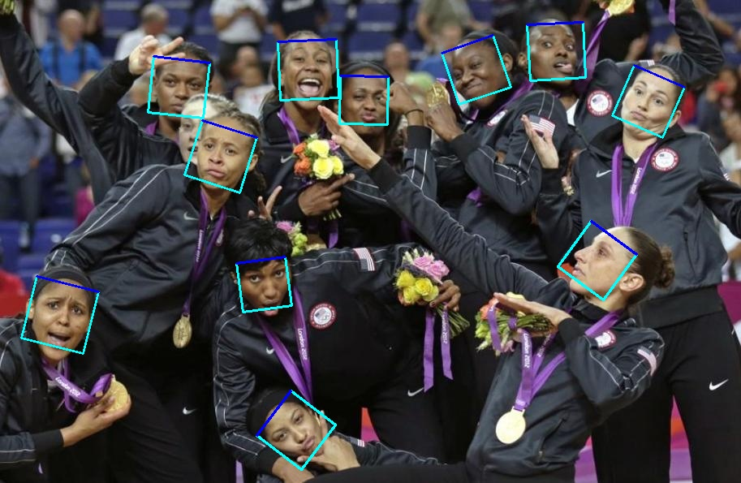
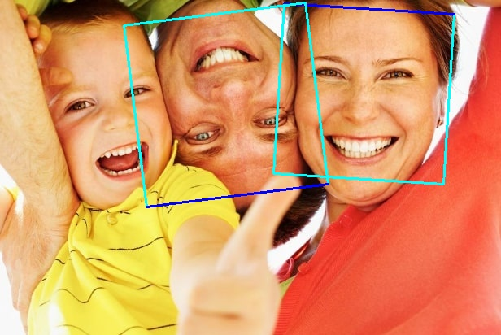

# PCN in Pytorch

[English version](README.md).

渐进校准网络(PCN)是一个又快又准，又具有旋转不变性的人脸检测模型，能在CPU上达到实时，本仓库是[原仓库](https://github.com/Jack-CV/FaceKit/tree/master/PCN)的一个Pytorch实现。

## Getting Started

推荐使用一个独立的Python环境。
+ Python3.5+ (Python3.5, Python3.6 are tested)
+ Pytorch == 1.0
+ opencv4 (opencv3.4.5 is tested also)
+ numpy

使用`pip`来安装依赖。
```bash
pip3 install numpy opencv-python
pip3 install https://download.pytorch.org/whl/cpu/torch-1.0.1.post2-cp36-cp36m-linux_x86_64.whl
pip3 install torchvision (optional)
```
或者使用`conda`
```bash
conda install opencv numpy
conda install pytorch-cpu torchvision-cpu -c pytorch
```

## Usage
```bash
cd pytorch-PCN
python demo.py path/to/image 
```
或者也可以使用摄像头！
```bash
python webcam.py
```

## Install
```
cd pytorch-PCN
pip install .
```

## Results





你可以在`result`文件夹下找到更多的例子，或者你也可以运行脚本来生成。

仍然有一张图片检测失败，欢迎Pull request来修复这个问题。



### License
这份代码的许可证是[BSD 2-Clause license](LICENSE).

### Citing & Thanks
    @inproceedings{shiCVPR18pcn,
        Author = {Xuepeng Shi and Shiguang Shan and Meina Kan and Shuzhe Wu and Xilin Chen},
        Title = {Real-Time Rotation-Invariant Face Detection with Progressive Calibration Networks},
        Booktitle = {The IEEE Conference on Computer Vision and Pattern Recognition (CVPR)},
        Year = {2018}
    }
    
### Wishes
对于听说过，见过，想过或者使用过这个仓库的人，我祝愿他们都得到暂时的快乐与永久不变的快乐。
