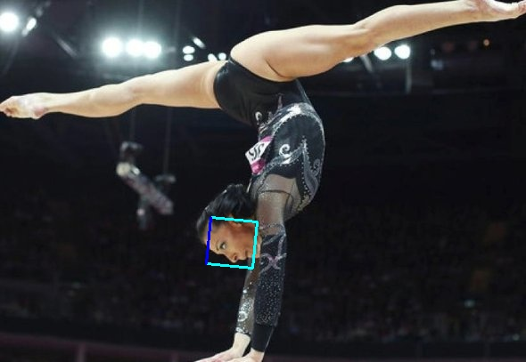

# PCN in Pytorch
_**WARNING: This implement is in an almost finished state. See the [Results](#Results) section for more details.**_ 

[中文版](README-zh.md).


Progressive Calibration Networks (PCN) is an accurate rotation-invariant face detector running at real-time speed on CPU. This is an implementation for PCN.

This is a pytorch implemented version of the [original repo](https://github.com/Jack-CV/FaceKit/tree/master/PCN)

## Getting Started

A separate Python environment is recommended.
+ Python3.5+ (Python3.5, Python3.6 are tested)
+ Pytorch == 1.0
+ opencv4 (opencv3.4.5 is tested also)
+ numpy

install dependences using `pip` or `conda`
```
pip3 install numpy opencv-python
pip3 install https://download.pytorch.org/whl/cpu/torch-1.0.1.post2-cp36-cp36m-linux_x86_64.whl
pip3 install torchvision (optional)
```
or install using `conda`
```
conda install opencv numpy
conda install pytorch-cpu torchvision-cpu -c pytorch
```

## Usage
```
python pcn.py path/to/image 
```

## Results
These are successful examples:




The original implement uses `C++/caffe` and I'm not sure whether this is the main reason that results in certain failed examples as follow:


More results can be found in `result` directory, or you can run the script to generate them.

## Contributions
I need help to solve the problem I mention in *Results* section. I mainly debug in [my own repo](https://github.com/siriusdemon/hackaway/tree/master/projects/pcn). If you are interested in fixing it, there are some test scripts you may find them helpful. I keep them in my own repo to avoid confusion.

### License
This code is distributed under the [BSD 2-Clause license](LICENSE).

### Citing & Thanks
@inproceedings{shiCVPR18pcn,
    Author = {Xuepeng Shi and Shiguang Shan and Meina Kan and Shuzhe Wu and Xilin Chen},
    Title = {Real-Time Rotation-Invariant Face Detection with Progressive Calibration Networks},
    Booktitle = {The IEEE Conference on Computer Vision and Pattern Recognition (CVPR)},
    Year = {2018}
}